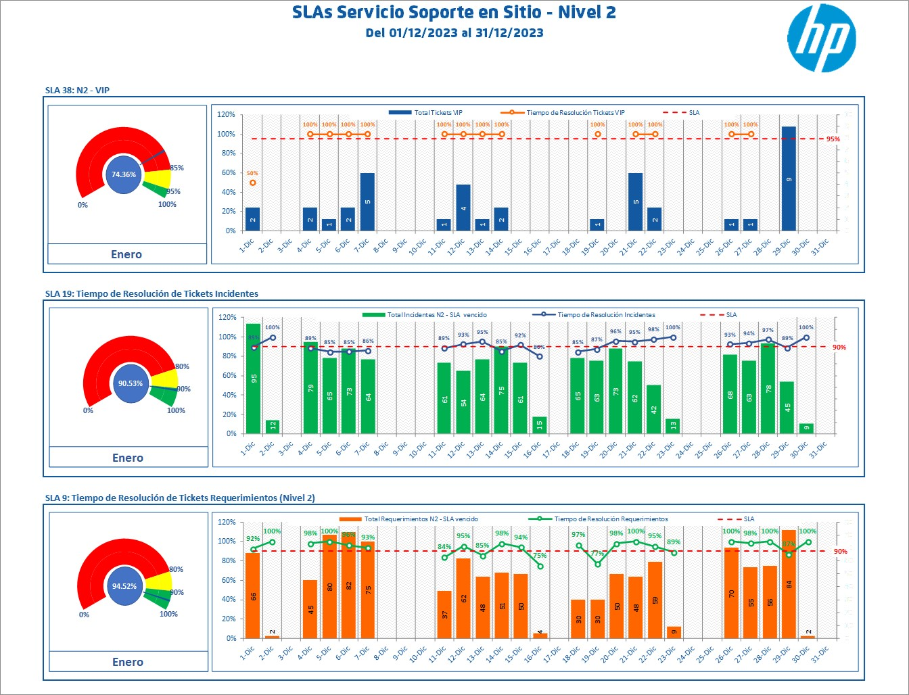

# MacroReports
Daily reports with Excel Macros

## Description
This project is a VBA Excel Macro designed for reviewing daily SLAs. It allows you to get data from SQL, do calculations, build charts with daily information, and send this report through email.


## Table of Contents
1. [Background](#background)
2. [Technologies Used](#technologies-used)
3. [Preview](#preview)
4. [Features](#features)
5. [Sample Data](#sample-data)
6. [Code Snippets](#code-snippets)
   - [SQL](#sql)
   - [VBA](#vba)
7. [Contacts and Support](#contacts-and-support)

## Background
This project addressed a specific need for the service we provided to our client, a financial institution. The task involved retrieving information from the ticketing tool, calculating resolution times according to the established SLAs, and then sending these results via email.

## Technologies Used
The following technologies were used to develop this dashboard:
- **SQL**: For data querying and manipulation.
- **ODBC**: For connect excel with the database
- **VBA Excel**: For programming code, and charts.
- **Task Scheduler**: For automating duties.

## Preview


## Features
- Visualizations: line charts, bar charts, doughnut charts.

## Sample Data
An example of the data utilized for this project can be found in the file `Sample Data/SampleData - MacroReports.xlsx`. 
> [!NOTE]
> Please note that the original data has been intentionally excluded to ensure privacy and confidentiality.

## Code Snippets
### SQL

query to get the data from the database
```
-- MACRO PARA CALCULO DE SLA DE L2
-- MODIFICADO POR MARCO CHANG PARA REMEDY 9
 
SELECT
INCIDENT_NUMBER AS [Ticket],
'I' AS [Tipo de Caso],
(CATEGORIZACION_CAPA_1+ '.' +CATEGORIZACION_CAPA_2+ '.' +CATEGORIZACION_CAPA_3+ '.' +
CATEGORIA_PRODUCTO_CAPA_1+ '.' +CATEGORIA_PRODUCTO_CAPA_2+ '.' +CATEGORIA_PRODUCTO_CAPA_3) AS [Categoría],
CATEGORIZACION_CAPA_1 AS Cat_Ope_1,
CATEGORIZACION_CAPA_2 AS Cat_Ope_2,
CATEGORIZACION_CAPA_3 AS Cat_Ope_3,
CATEGORIA_PRODUCTO_CAPA_1 AS Cat_Pro_1,
CATEGORIA_PRODUCTO_CAPA_2 AS Cat_Pro_2,
CATEGORIA_PRODUCTO_CAPA_3 AS Cat_Pro_3,
isnull(APELLIDO,'') + ' ' + isnull(NOMBRE,'') AS [Usuario Afectado],
ID_CORPORATIVO as [matricula_user_afec],
SITIO_FISICO AS [Ubicación],
INDICADOR_VIP AS [VIP?],
CHR_REPORT_SOURCE AS [Metodo de Reporte],
'.' AS [Descripción en proceso], 
RESOLUTION   AS [Descripción solución],
(CASE ESTADO 
WHEN 0 THEN 'Nuevo'
WHEN 1 THEN 'Asignado'
WHEN 2 THEN 'En curso'
WHEN 3 THEN 'Pendiente'
WHEN 4 THEN 'Resuelto'
WHEN 5 THEN 'Cerrado'
WHEN 6 THEN 'Cancelado'
ELSE '' END) AS [Estado],
CHR_URGENCIA as [Urgencia],
CHR_IMPACTO as [Impacto],
PRIORIDAD as [Prioridad],
ASIGNADO AS [Técnico Asignado],
GRUPO_ASIGNADO AS  [Grupo Asignado],
CASE WHEN SOLICITANTE='AR_WEBSERVICES' OR SOLICITANTE='APWEBHDPRO' THEN 'Usuario Web de Helpdesk' ELSE SOLICITANTE END AS [Creado Por],
CASE WHEN SOLICITANTE='AR_WEBSERVICES' OR SOLICITANTE='APWEBHDPRO' THEN 'HELPDESK WEB' ELSE OWNER_GROUP END AS [Grupo Creador],
(SELECT TOP 1 MAX(FECHA_CREACION)
FROM
LOG_V_INC_USR with (nolock)
WHERE
ID_DE_PETICION_ORIGEN = INCIDENT_NUMBER
AND ESTADO_NUEVO = 'In Progress  (2)') AS  [En Proceso],
(SELECT TOP 1 MAX(FECHA_CREACION)
FROM
LOG_V_INC_USR with (nolock)
WHERE ID_DE_PETICION_ORIGEN = INCIDENT_NUMBER
AND ESTADO_NUEVO = 'Pending  (3)'
) AS [Pendiente],
FECHA_SOLICITUD AS [Fecha_Apertura],
isnull((
SELECT TOP 1 MAX(FECHA_CREACION)
FROM
LOG_V_INC_USR with (nolock)
WHERE ID_DE_PETICION_ORIGEN = INCIDENT_NUMBER
AND Log LIKE '%Assigned Group:%'
),FECHA_SOLICITUD) AS  [Asignado],
FECHA_ULTIMA_RESUELTO AS [Fecha_Resuelto],
CATEGORIA_RESOLUCION AS [Categoria Resolucion 1], 
CATEGORIA_RESOLUCION_CAPA_2 AS [Categoria Resolucion 2], 
CHR_FECHACIERRE AS [Fecha_Cierre],
'' AS [Motivo de Cierre], 
DESCRIPCION AS [Resumen],
DETAILED_DECRIPTION AS [Descripción],
CATEGORIZACION_GENERICA_CAPA_1 AS [Causa Raiz],
SOCIEDAD AS [Organización Usuario Afectado],
(SELECT TOP 1
ASOC.Request_Description01
FROM
HPD_ASOCIACIONES ASOC
WHERE 
ASOC.REQUEST_ID02 = INCIDENT_NUMBER
AND ASOC.Request_Description01 = 'SOPORTE REMOTO') AS [Resuelto Remotamente],
''  AS [Asignado Incorrectamente],
CHR_TMPPROPIEDAD01,
CF_ETIQUETA1,
CHR_TMPPROPIEDAD02,
CF_ETIQUETA2,
CHR_TMPPROPIEDAD03,
CF_ETIQUETA3,
CHR_TMPPROPIEDAD04,
CF_ETIQUETA4,
CHR_TMPPROPIEDAD05,
CF_ETIQUETA5,
CHR_TMPPROPIEDAD06,
CF_ETIQUETA6,
CHR_TMPPROPIEDAD07,
CF_ETIQUETA7,
CHR_TMPPROPIEDAD08,
CF_ETIQUETA8,
CHR_TMPPROPIEDAD09,
CF_ETIQUETA9,
CHR_TMPPROPIEDAD10,
CF_ETIQUETA10,
CHR_TMPPROPIEDAD11,
CF_ETIQUETA11,
CHR_TMPPROPIEDAD12,
CF_ETIQUETA12,
CHR_TMPPROPIEDAD13,
CF_ETIQUETA13,
CHR_TMPPROPIEDAD14,
CF_ETIQUETA14,
CHR_TMPPROPIEDAD15,
CF_ETIQUETA15,
CHR_TMPPROPIEDAD16,
CF_ETIQUETA16,
CHR_TMPPROPIEDAD17,
CF_ETIQUETA17,
CHR_TMPPROPIEDAD18,
CF_ETIQUETA18,
CHR_TMPPROPIEDAD19,
CF_ETIQUETA19,
CHR_TMPPROPIEDAD20,
CF_ETIQUETA20,
CHR_TMPPROPIEDAD21,
CF_ETIQUETA21,
CHR_TMPPROPIEDAD22,
CF_ETIQUETA22,
CHR_TMPPROPIEDAD23,
CF_ETIQUETA23,
CHR_TMPPROPIEDAD24,
CF_ETIQUETA24,
CHR_TMPPROPIEDAD25,
CF_ETIQUETA25,
CHR_TMPPROPIEDAD26,
CF_ETIQUETA26,
CHR_TMPPROPIEDAD27,
CF_ETIQUETA27,
CHR_TMPPROPIEDAD28,
CF_ETIQUETA28,
CHR_TMPPROPIEDAD29,
CF_ETIQUETA29,
CHR_TMPPROPIEDAD30,
CF_ETIQUETA30
FROM
INC_V_GLOBAL_USR with (nolock)
WHERE GRUPO_ASIGNADO LIKE 'HP%' 
AND FECHA_ULTIMA_RESUELTO >= convert(varchar,Year(GETDATE() - 1),121) + '-' + convert(varchar,datepart(mm,DATEADD(day,-1,GETDATE())),121) + '-01'
AND FECHA_ULTIMA_RESUELTO < CONVERT(char(10),GETDATE(), 121)
 
UNION ALL
 
SELECT
WORK_ORDER_ID AS [ID del Caso],
'R' AS [Tipo de Caso],
(CATEGORIZACION_CAPA_1+ '.' +CATEGORIZACION_CAPA_2+ '.' +CATEGORIZACION_CAPA_3+ '.' +
PRODUC_CAT_NIVEL_1_2_+ '.' +PRODUC_CAT_NIVEL_2__2_+ '.' +PRODUC_CAT_NIVEL_3__2_) AS [Categoría],
CATEGORIZACION_CAPA_1 AS Cat_Ope_1,
CATEGORIZACION_CAPA_2 AS Cat_Ope_2,
CATEGORIZACION_CAPA_3 AS Cat_Ope_3,
PRODUC_CAT_NIVEL_1_2_ AS Cat_Pro_1,
PRODUC_CAT_NIVEL_2__2_ AS Cat_Pro_2,
PRODUC_CAT_NIVEL_3__2_ AS Cat_Pro_3,
isnull(CLIENTE_PRIMER_NOMBRE,'')+' '+isnull(CLIENTE_APELLIDOS,'') AS [Usuario Afectado],
SOLICITANTE AS [matricula_user_afec],
SITIO_FISICO AS [Ubicación],
INDICADOR_VIP AS [VIP?],
CHR_REPORT_SOURCE AS [Metodo de Reporte],
'' AS [Descripción en proceso], 
'' AS [Descripción solución],
(CASE ESTADO 
WHEN 0 THEN 'Asignado'
WHEN 1 THEN 'Pendiente'
WHEN 2 THEN 'Esperando autorización'
WHEN 3 THEN 'Planificación'
WHEN 4 THEN 'En curso'
WHEN 5 THEN 'Terminado'
WHEN 6 THEN 'Rechazado'
WHEN 7 THEN 'Cancelado'
WHEN 8 THEN 'Cerrado'
ELSE '' END) AS [Estado],
NULL as [Urgencia],
NULL as [Impacto], 
PRIORIDAD as [Prioridad],
ASCHG AS [Técnico Asignado],
ASGRP AS  [Grupo Asignado],
CASE WHEN SUBMITTER='AR_WEBSERVICES' OR SUBMITTER='APWEBHDPRO' THEN 'Usuario Web de Helpdesk' ELSE SUBMITTER END AS [Creado Por],
CASE WHEN SUBMITTER='AR_WEBSERVICES' OR SUBMITTER='APWEBHDPRO' THEN 'HELPDESK WEB' ELSE nombre_grupo_soporte end AS [Grupo Creador],
(
SELECT TOP 1 MAX(PEND.[FECHA SIGUIENTE])
FROM
(
SELECT LEAD(FECHA_CREACION) OVER(ORDER BY FECHA_CREACION ASC) AS [FECHA SIGUIENTE], *
FROM WAUD_V_WOI_USR with (nolock)
WHERE
ID_DE_PETICION_ORIGEN = Work_Order_ID
)PEND
WHERE PEND.ESTADO_NUEVO = ' In Progress  (4)'
) AS  [En Proceso],
(
SELECT TOP 1 MAX(PEND.[FECHA SIGUIENTE])
FROM
(
SELECT LEAD(FECHA_CREACION) OVER(ORDER BY FECHA_CREACION ASC) AS [FECHA SIGUIENTE], *
FROM WAUD_V_WOI_USR with (nolock)
WHERE
ID_DE_PETICION_ORIGEN = WORK_ORDER_ID
)PEND
WHERE PEND.ESTADO_NUEVO = ' Pending  (1)'
) AS [Pendiente],
FECHA_SOLICITUD AS [Fecha_Apertura],
isnull((SELECT TOP 1 MAX(FECHA_CREACION) 
FROM
WAUD_V_WOI_USR with (nolock) 
where 
ID_DE_PETICION_ORIGEN = WORK_ORDER_ID 
AND DESCRIPCION_BREVE = 'CAMBIO DE GRUPO'
),FECHA_SOLICITUD) AS  [Asignado],
COMPLETED_DATE AS [Fecha_Resuelto],
'' AS [Categoria Resolucion 1], 
'' AS [Categoria Resolucion 2],  
CHR_FECHACIERRE AS [Fecha_Cierre],
Chr_Status_Reason as [Motivo de Cierre], 
RESUMEN as [Resumen],
DETAILED_DESCRIPTION    AS [Descripción],
NULL AS [Causa Raiz],
CLIENTE_SOCIEDAD AS [Organización Usuario Afectado],
(SELECT TOP 1
ASOC.Request_Description01
FROM
WOI_ASOCIACIONES ASOC
WHERE 
ASOC.REQUEST_ID02 = WORK_ORDER_ID
AND ASOC.Request_Description01 = 'SOPORTE REMOTO')  AS [Resuelto Remotamente],
'' AS [Asignado Incorrectamente],
CHR_TMPPROPIEDAD01,
CF_ETIQUETA1,
CHR_TMPPROPIEDAD02,
CF_ETIQUETA2,
CHR_TMPPROPIEDAD03,
CF_ETIQUETA3,
CHR_TMPPROPIEDAD04,
CF_ETIQUETA4,
CHR_TMPPROPIEDAD05,
CF_ETIQUETA5,
CHR_TMPPROPIEDAD06,
CF_ETIQUETA6,
CHR_TMPPROPIEDAD07,
CF_ETIQUETA7,
CHR_TMPPROPIEDAD08,
CF_ETIQUETA8,
CHR_TMPPROPIEDAD09,
CF_ETIQUETA9,
CHR_TMPPROPIEDAD10,
CF_ETIQUETA10,
CHR_TMPPROPIEDAD11,
CF_ETIQUETA11,
CHR_TMPPROPIEDAD12,
CF_ETIQUETA12,
CHR_TMPPROPIEDAD13,
CF_ETIQUETA13,
CHR_TMPPROPIEDAD14,
CF_ETIQUETA14,
CHR_TMPPROPIEDAD15,
CF_ETIQUETA15,
CHR_TMPPROPIEDAD16,
CF_ETIQUETA16,
CHR_TMPPROPIEDAD17,
CF_ETIQUETA17,
CHR_TMPPROPIEDAD18,
CF_ETIQUETA18,
CHR_TMPPROPIEDAD19,
CF_ETIQUETA19,
CHR_TMPPROPIEDAD20,
CF_ETIQUETA20,
CHR_TMPPROPIEDAD21,
CF_ETIQUETA21,
CHR_TMPPROPIEDAD22,
CF_ETIQUETA22,
CHR_TMPPROPIEDAD23,
CF_ETIQUETA23,
CHR_TMPPROPIEDAD24,
CF_ETIQUETA24,
CHR_TMPPROPIEDAD25,
CF_ETIQUETA25,
CHR_TMPPROPIEDAD26,
CF_ETIQUETA26,
CHR_TMPPROPIEDAD27,
CF_ETIQUETA27,
CHR_TMPPROPIEDAD28,
CF_ETIQUETA28,
CHR_TMPPROPIEDAD29,
CF_ETIQUETA29,
CHR_TMPPROPIEDAD30,
CF_ETIQUETA30
FROM
WOI_V_GLOBAL_USR with (nolock)        
WHERE
ASGRP LIKE 'HP%'  
and COMPLETED_DATE >= convert(varchar,Year(GETDATE() - 1),121) + '-' + convert(varchar,datepart(mm,DATEADD(day,-1,GETDATE())),121) + '-01'
and COMPLETED_DATE < CONVERT(char(10),GETDATE(), 121)
```

### VBA

In this section, I share some of the key methods and functions developed in VBA (Visual Basic for Applications) used throughout my projects:
- **Get the data when the file (.xlsm) is opened**:
  ```
  Sub Actualizar()

    Dim conexion As Variant

    For Each conexion In ActiveWorkbook.Connections
        conexion.ODBCConnection.BackgroundQuery = False
    Next conexion

    ActiveWorkbook.RefreshAll

   End Sub
  ```
- **Send email when completing calculations**:
  ```
  Sub EnviarReporte_O365()

    Dim OApp As Object
    Dim OMail As Object
    Dim Body As String
    Dim RutaImagen As String
    Dim ArchivoImagen As String
    Dim NombreArchivo As String
    Application.ScreenUpdating = False
    Application.DisplayAlerts = False
    RutaImagen = "D:\Marco - HP - Sonda\Reportes\SLA N2"
    NombreArchivo = "Reporte_BCP_SLA-L2"
    ArchivoImagen = RutaImagen & "\" & NombreArchivo & ".jpg"
        
    On Error Resume Next
    
    
    Call CrearImagenRango_O365(ThisWorkbook.Sheets("Dashboard N2"), RutaImagen, "B1:V50", NombreArchivo)
    
    Set OApp = CreateObject("Outlook.Application")
    Set OMail = OApp.CreateItem(0)
    Body = ""
    Fecha = Format(Now - 1, "dd/mm/yyyy")
    
    With OMail
    
        .To = Para
        .CC = CC
        .Subject = "SLA Nivel 2 - " & (Fecha)
        .BodyFormat = olFormatHTML
        .HTMLBody = Body
        .Display
        .Send
    
    End With
    
    Set OMail = Nothing
    Set OApp = Nothing
    
    Application.ScreenUpdating = True
    Application.DisplayAlerts = True

   End Sub
  ```

## Contacts and Support
For any questions or support, contact [Marco Chang](mailto:marcochangbegazo@gmail.com).
